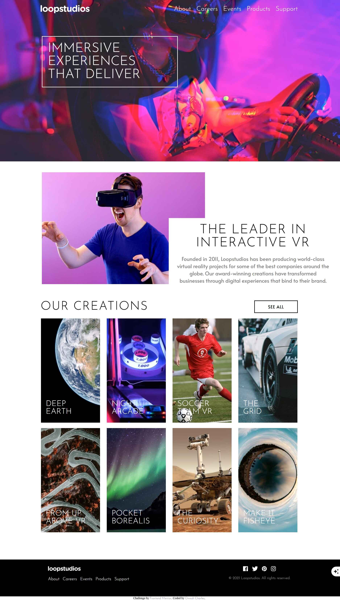

# Frontend Mentor - Loopstudios landing page solution

This is a solution to the [Loopstudios landing page challenge on Frontend Mentor](https://www.frontendmentor.io/challenges/loopstudios-landing-page-N88J5Onjw). Frontend Mentor challenges help you improve your coding skills by building realistic projects. 

## Table of contents

- [Overview](#overview)
  - [The challenge](#the-challenge)
  - [Screenshot](#screenshot)
  - [Links](#links)
- [My process](#my-process)
  - [Built with](#built-with)
  - [What I learned](#what-i-learned)
  - [Continued development](#continued-development)
- [Author](#author)

## Overview

### The challenge

Users should be able to:

- View the optimal layout for the site depending on their device's screen size
- See hover states for all interactive elements on the page

### Screenshot

### Links

- Solution URL: [https://github.com/Ot-Charlie/Loopstudios-landing-page]
- Live Site URL: [https://ot-charlie.github.io/Loopstudios-landing-page/]

## My process

### Built with

- Semantic HTML5 markup
- CSS custom properties
- Flexbox
- CSS Grid
- Mobile-first workflow

### What I learned
This was my first time working with mobile-first workflow, so I learnt how to prioritze the designs meant for mobile view first then add as you go. 

### Continued development
Media query seems very technical in mobile-first workflow, so I hope to continue developing and get better at it.

## Author

- Website - [Onwuli Charles](https://onwuli-charles.netlify.app)
- Frontend Mentor - [Ot.charlie](https://www.frontendmentor.io/profile/ot.charlie)
- Twitter - [Charl3s](https://www.twitter.com/kingcharlie01)

